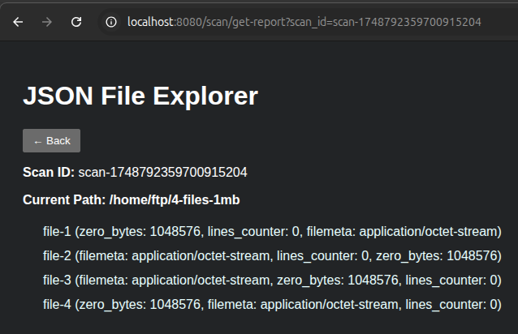

# FTP Scanning System

---

## Требования

1.  Kubernetes-кластер (k3s, k8s, minikube и т. п.)
    
2.  Helm 3+ (для развёртывания ELK).
    
3.  Curl (для тестирования HTTP-запросов).
    

---

## Установка

### Развёртывание ELK-стека

> **Примечание:** если уже есть ELK-стек или не планируется использовать его, пропустите этот раздел.

1.  Перейдите в корень проекта.
    
    ```bash
    cd <путь_к_репозиторию>
    ```
    
2.  Установите Filebeat:
    
    ```bash
    helm install filebeat k8s/elk/0-filebeat
    ```
    
    После выполнения команда должна вывести что-то вроде:
    
    ```text
    NAME: filebeat
    LAST DEPLOYED: <дата>
    NAMESPACE: default
    STATUS: deployed
    REVISION: 1
    TEST SUITE: None
    NOTES:
    1. Watch all containers come up.
      $ kubectl get pods --namespace=default -l app=filebeat-filebeat -w
    ```
    
3.  Установите Logstash:
    
    ```bash
    helm install logstash k8s/elk/1-logstash
    ```
    
    Ожидаемый вывод:
    
    ```text
    NAME: logstash
    LAST DEPLOYED: <дата>
    NAMESPACE: default
    STATUS: deployed
    REVISION: 1
    TEST SUITE: None
    NOTES:
    1. Watch all cluster members come up.
      $ kubectl get pods --namespace=default -l app=logstash-logstash -w
    ```
    
4.  Установите Elasticsearch:
    
    ```bash
    helm install elasticsearch k8s/elk/2-elasticsearch
    ```
    
    Ожидаемый вывод:
    
    ```text
    NAME: elasticsearch
    LAST DEPLOYED: <дата>
    NAMESPACE: default
    STATUS: deployed
    REVISION: 1
    NOTES:
    1. Watch all cluster members come up.
      $ kubectl get pods --namespace=default -l app=elasticsearch-master -w
    2. Test cluster health using Helm test.
      $ helm --namespace=default test elasticsearch
    ```
    
5.  Установите Kibana:
    
    ```bash
    helm install kibana k8s/elk/3-kibana
    ```
    
    Ожидаемый вывод:
    
    ```text
    NAME: kibana
    LAST DEPLOYED: <дата>
    NAMESPACE: default
    STATUS: deployed
    REVISION: 1
    TEST SUITE: None
    ```
    
6.  После этого проверьте статус всех подов ELK:
    
    ```bash
    kubectl get po
    ```
    
    Пример ожидаемого состояния:
    
    ```text
    NAME                             READY   STATUS    RESTARTS   AGE
    elasticsearch-master-0           1/1     Running   0          2m15s
    elasticsearch-master-1           1/1     Running   0          2m15s
    elasticsearch-master-2           1/1     Running   0          2m15s
    filebeat-filebeat-zhdss          1/1     Running   0          3m20s
    kibana-kibana-76f5645bfb-qmtps   1/1     Running   0          92s
    logstash-logstash-0              1/1     Running   0          3m5s
    ```
    

---

### Развёртывание Prometheus

1.  Создайте namespace для Prometheus Operator:
    
    ```bash
    kubectl apply -f k8s/prometheus-operator/namespace.yaml
    ```
    
2.  Зарегистрируйте CRD (Custom Resource Definitions):
    
    ```bash
    kubectl apply --server-side -f k8s/prometheus-operator/crds
    ```
    
3.  Примените RBAC-манифесты:
    
    ```bash
    kubectl apply -f k8s/prometheus-operator/rbac
    ```
    
4.  Разверните сам Prometheus Operator:
    
    ```bash
    kubectl apply -f k8s/prometheus-operator/deployment
    ```
    
5.  Создайте экземпляр Prometheus:
    
    ```bash
    kubectl apply -f k8s/prometheus
    ```
    
6.  Проверьте, что поды Prometheus Operator и Prometheus поднялись в namespace `monitoring`:
    
    ```bash
    kubectl get po -n monitoring
    ```
    
    Ожидаемый результат:
    
    ```text
    NAME                                  READY   STATUS    RESTARTS   AGE
    prometheus-main-0                     2/2     Running   0          49s
    prometheus-operator-fc598748f-nrfzp   1/1     Running   0          74s
    ```
    

---

### Развёртывание FTP Scanning System

1.  Создайте namespace `staging`:
    
    ```bash
    kubectl apply -f k8s/ftp-scanning-system/0-namespace.yaml
    ```
    
2.  Разверните все необходимые сервисы (Kafka, MongoDB, Grafana и т. п.):
    
    ```bash
    kubectl apply -f k8s/ftp-scanning-system/1-necessary-services.yaml
    ```
    
    Затем дождитесь, когда под `kafka-0` получит статус `Running`:
    
    ```bash
    kubectl get po -n staging
    ```
    
    Пример:
    
    ```text
    NAME          READY   STATUS    RESTARTS   AGE
    grafana-0     1/1     Running   0          48s
    grafana-2-0   1/1     Running   0          48s
    kafka-0       1/1     Running   0          48s
    kafka-1       1/1     Running   0          48s
    kafka-2       1/1     Running   0          48s
    mongodb-0     1/1     Running   0          48s
    ```
    
    После этого проверьте логи `kafka-0` и дождитесь сообщения о том, что Kafka REST-сервер запущен:
    
    ```bash
    kubectl logs kafka-0 -n staging -f
    ```
    
    Ожидается строка:
    
    ```arduino
    INFO Server started, listening for requests... (io.confluent.kafkarest.KafkaRestMain)
    ```
    
3.  Настройка Kafka-топиков:
    
    ```bash
    kubectl apply -f k8s/ftp-scanning-system/2-kafka-setup.yaml
    ```
    
    Дождитесь, когда под `kafka-topics-job` перейдёт в статус `Completed`:
    
    ```bash
    kubectl get po -n staging
    ```
    
    Пример:
    
    ```text
    NAME                     READY   STATUS      RESTARTS   AGE
    grafana-0                1/1     Running     0          3m59s
    grafana-2-0              1/1     Running     0          3m59s
    kafka-0                  1/1     Running     0          3m59s
    kafka-1                  1/1     Running     0          3m59s
    kafka-2                  1/1     Running     0          3m59s
    kafka-topics-job-ljrts   0/1     Completed   0          39s
    mongodb-0                1/1     Running     0          3m59s
    ```
    
4.  Разверните Redpanda Console:
    
    ```bash
    kubectl apply -f k8s/ftp-scanning-system/3-redpanda-console.yaml
    ```
    
5.  Разверните сервисы FTP Scanning System:
    
    ```bash
    kubectl apply -f k8s/ftp-scanning-system/4-ftp-scanning-system.yaml
    ```
    
    > **Важно:**  
    > В манифесте `4-ftp-scanning-system.yaml` задано по 2 реплики для сервисов-листеров директорий и файловых сканеров. Если ваш FTP-сервер ограничивает количество одновременных подключений, настройте количество реплик под себя
    
6.  Дождитесь, когда все поды в `staging` получат статус `Running`:
    
    ```bash
    kubectl get po -n staging
    ```
    
    Пример:
    
    ```text
    NAME                                                     READY   STATUS      RESTARTS   AGE
    counter-reducer-completed-directories-7b6f8d465c-l9jpl   1/1     Running     0          2m28s
    counter-reducer-completed-files-f864f9fb5-x2679          1/1     Running     0          2m28s
    counter-reducer-scan-directories-695d7cf47f-72wg9        1/1     Running     0          2m28s
    counter-reducer-scan-files-6876f85f5-rz66m               1/1     Running     0          2m28s
    directory-lister-service-58bd548cc6-ggr58                1/1     Running     0          2m28s
    directory-lister-service-58bd548cc6-kwwhn                1/1     Running     0          2m28s
    file-scanner-service-7dbc4cfbfd-d8p6b                    1/1     Running     0          2m28s
    file-scanner-service-7dbc4cfbfd-pwg7j                    1/1     Running     0          2m28s
    generate-report-service-6966d7c68-s4ggw                  1/1     Running     0          2m27s
    get-report-service-77d4875ff6-mtjkn                      1/1     Running     0          2m27s
    grafana-0                                                1/1     Running     0          7m58s
    grafana-2-0                                              1/1     Running     0          7m58s
    kafka-0                                                  1/1     Running     0          7m58s
    kafka-1                                                  1/1     Running     0          7m58s
    kafka-2                                                  1/1     Running     0          7m58s
    kafka-topics-job-ljrts                                   0/1     Completed   0          4m38s
    main-service-5ff7bffc86-w74dc                            1/1     Running     0          2m28s
    mongodb-0                                                1/1     Running     0          7m58s
    redpanda-console-558cdf49f9-wzztf                        1/1     Running     0          3m25s
    scan-result-reducer-service-7ccf658b4c-bxh28             1/1     Running     0          2m28s
    status-service-79f77c495b-q4d84                          1/1     Running     0          2m27s
    ```
    

---

### Проброс портов для доступа

Чтобы получить доступ к веб-интерфейсам и сервисам, пробросьте следующие порты (пример для кластера k3s):

1.  Main Service (HTTP API)
    
    ```bash
    kubectl port-forward service/main-service 8080 -n staging
    ```
    
    Доступ: [http://localhost:8080](http://localhost:8080)
    
2.  Redpanda Console
    
    ```bash
    kubectl port-forward service/redpanda-console 8085:80 -n staging
    ```
    
    Доступ: [http://localhost:8085](http://localhost:8085)
    
3.  Grafana
    
    ```bash
    kubectl port-forward service/grafana 3000 -n staging
    ```
    
    Доступ: [http://localhost:3000](http://localhost:3000) (стандартные креды: `admin:admin`)
    
4.  Prometheus
    
    ```bash
    kubectl port-forward pods/prometheus-main-0 9090 -n monitoring
    ```
    
    Доступ: [http://localhost:9090](http://localhost:9090)
    
5.  MongoDB (для локального подключения через Mongo Shell или GUI)
    
    ```bash
    kubectl port-forward service/mongodb 27017 -n staging
    ```
    
    Подключаться к `mongodb://localhost:27017`
    
6.  Kibana (NodePort)
    
    -   Узнайте внешний порт, назначенный сервису `kibana-kibana`:
        
        ```bash
        kubectl get svc
        ```
        
        Пример:
        
        ```text
        NAME                            TYPE        CLUSTER-IP      EXTERNAL-IP   PORT(S)             AGE
        elasticsearch-master            ClusterIP   10.43.195.36    <none>        9200/TCP,9300/TCP   21m
        elasticsearch-master-headless   ClusterIP   None            <none>        9200/TCP,9300/TCP   21m
        kibana-kibana                   NodePort    10.43.114.185   <none>        5601:30237/TCP      20m
        logstash-logstash               ClusterIP   10.43.91.238    <none>        5044/TCP,8080/TCP   21m
        logstash-logstash-headless      ClusterIP   None            <none>        9600/TCP            21m
        ```
        
    -   В данном примере NodePort для Kibana — `30237`, соответственно доступ:  
        http://localhost:30237
        

---

## Запуск сканирования

### Инициация сканирования (POST-запрос)

Для запуска сканирования FTP-сервера необходимо знать:

-   **`ftp_server`** — IP или хостнейм FTP (например, `192.168.1.100`).
    
-   **`ftp_port`** — порт FTP (обычно `21`).
    
-   **`ftp_username`** / **`ftp_password`** — учётные данные.
    
-   **`directory_path`** — полный путь к директории на FTP (например, `home/user/files-to-scan`).
    
-   **`scan_types`** — массив типов сканирования:
    
    -   `zero_bytes` — считать нулевые байты,
        
    -   `filemeta` — определять MIME-тип,
        
    -   `lines_counter` — считать строки.
        

> Если выбрать более одного типа, итоговое число просканированных файлов будет выводится равным количеству найденных файлов × количество выбранных типов.

```bash
curl --location 'http://localhost:8080/scan/get-report' \
--header 'Content-Type: application/json' \
--data '{
    "directory_path": "/home/ftp/4-files-1mb",
    "scan_types": ["zero_bytes", "filemeta", "lines_counter"],
    "ftp_server": "XXX.XXX.XXX.XXX",
    "ftp_port": XX,
    "ftp_username": "XXXX",
    "ftp_password": "XXXX"
}'
```

**Пример ответа:**

```json
{
  "scan_id": "scan-1748792359700915204",
  "status": "accepted",
  "message": "Запрос на сканирование принят в обработку.",
  "start_time": "2025-06-01T15:39:19Z"
}
```

### Проверка статуса сканирования

Чтобы узнать текущий статус по `scan_id`, выполните GET-запрос:

```bash
curl --location 'http://localhost:8080/scan/status?scan_id=scan-1748792359700915204'
```

**Пример ответа (в процессе сканирования):**

```json
{
  "scan_id": "scan-1748792359700915204",
  "status": "in_progress",
  "directories_scanned": 1,
  "files_scanned": 5,
  "directories_found": 1,
  "files_found": 12,
  "start_time": "2025-06-01T15:40:19Z"
}
```

**После завершения:**

```json
{
  "scan_id": "scan-1748792359700915204",
  "status": "completed",
  "directories_scanned": 1,
  "files_scanned": 12,
  "directories_found": 1,
  "files_found": 12,
  "start_time": "2025-06-01T15:42:23Z"
}
```

### Генерация отчёта

Для создания HTML-отчёта выполните POST-запрос:

```bash
curl --location --request POST 'http://localhost:8080/scan/generate-report?scan_id=scan-1748792359700915204'
```

**Пример ответа:**

```json
{
  "scan_id": "scan-1748792359700915204",
  "message": "Отчет успешно сгенерирован"
}
```

После этого HTML-страница отчёта доступна по адресу:

```bash
http://localhost:8080/scan/get-report?scan_id=scan-1748792359700915204
```



---

## Мониторинг и дашборды

-   **Grafana**  
    Дашборд для отслеживания скорости сканирования доступен в корне проекта под названием `ftp_dashboard.json`.  
    
-   **Prometheus**  
    Собирает метрики из сервисов (через Prometheus Operator). Адрес: `http://localhost:9090`.  
    
-   **ELK-стек**
    
    -   Filebeat собирает логи контейнеров и отправляет в Logstash → Elasticsearch.
        
    -   Kibana (NodePort) показывает логи микросервисов и ошибок сканирования.